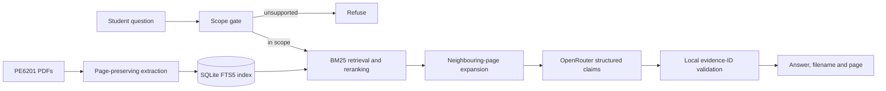

# PE6201 Course Assistant

PE6201 Course Assistant is a citation-first RAG system for the supplied PE6201 course materials. A student asks a natural-language question; the system retrieves relevant course evidence, generates an answer from that evidence, and shows the original filename and physical PDF page. If the evidence is insufficient or the request is outside the course scope, it refuses instead of guessing.

This is the final assignment package. It contains the authorised PE6201 `CONTENT` folder and a ready-to-use SQLite index. There is no synthetic corpus and no V1/V2/V3 program path: the command line runs the final V4 pipeline only.

> The instructor confirmed permission to include the course files in this project and confirmed that either a public or private repository is acceptable for submission.

## Install and run

Python 3.10 or later is required. From the unzipped project folder:

```bash
python3 -m venv .venv
source .venv/bin/activate
pip install -r requirements.txt
pip install --no-build-isolation .
```

This uses a normal local installation rather than editable mode, so it also works with Python 3.13 on macOS when the virtual-environment directory is hidden.

The corpus and index are already included, so no build step is required. Set an OpenRouter key in the current Terminal session:

```bash
export OPENROUTER_API_KEY="your-key"
export OPENROUTER_MODEL="google/gemini-3.8-flash"
export OPENROUTER_MAX_ESTIMATED_USD="2.00"
export OPENROUTER_BUDGET_LEDGER="data/processed/openrouter_budget.json"
```

Ask a question:

```bash
pe6201-rag ask \
  "What are the three stages of the RAG workflow?" \
  --model "$OPENROUTER_MODEL"
```

A successful answer includes inline markers and exact citations:

```text
Sources:
- [S1] PE6201_Class2_C3_RAG.pdf, p. 3

Grounded: Yes
External Knowledge: None used.
```

To inspect retrieval without calling a model:

```bash
pe6201-rag search \
  "What are the three stages of the RAG workflow?" \
  --top-k 12
```

Page numbers are physical PDF pages starting from 1. Never put an API key in the repository, a CSV, or a submitted `.env` file. The USD 2 ledger is a local estimate and guardrail, not an OpenRouter account-level limit; provider billing remains authoritative.

## Product documentation

### User and problem

The intended user is a PE6201 student revising a concept or preparing for class. The student may remember an idea without remembering the exact wording or which PDF contains it. Ctrl-F is transparent and can be fast, but it works best when the correct file and keyword are already known.

The assistant covers learning concepts in the supplied PE6201 PDFs. It does not complete graded assignments, provide live information, answer private or high-stakes questions, search the open web, or silently use general model knowledge.

### Input and output

- **Input:** one natural-language student question.
- **Output:** a grounded answer, `[S#]` evidence markers, original filename/path/physical page, confidence, grounded yes/no, and `External Knowledge` status.
- **Failure behaviour:** an unsupported question receives an abstention with no fabricated citation.

### Included material

- 85 PE6201 PDFs and 1,558 physical pages from `data/materials/CONTENT/`.
- 1,553 text-bearing pages and 2,260 page-aware chunks.
- A prebuilt SQLite FTS5 index and corpus manifest.
- The final V4 retrieval, neighbouring-page expansion, scope gate, OpenRouter generation, and local citation validation code.
- The frozen held-out set, verified V3/V4 results, safety cases, and manual Ctrl-F records.
- 24 offline unit tests and a release verifier.

The original `CONTENT.zip` is not duplicated because the extracted `CONTENT` folder is included. Synthetic materials, API keys, budget ledgers, virtual environments, caches, and private working notes are excluded.

## Repository structure

```text
.
├── data/
│   ├── materials/CONTENT/        # authorised PE6201 course materials
│   └── processed/
│       ├── pe6201.sqlite         # ready-to-use index
│       └── manifest.json         # corpus counts and hashes
├── docs/openrouter_deployment.md
├── evals/
│   ├── README.md
│   └── heldout/
├── src/pe6201_rag/
├── scripts/verify_release.py
└── tests/
```

## How V4 works



The local program owns page extraction, metadata, retrieval, reranking, safety rules, citation validation, answer formatting and evaluation. It uses the open-source `pypdf` package to extract PDF text and rents a model through OpenRouter to write the evidence-constrained answer.

The final design uses:

- SQLite FTS5 and BM25 for local, inspectable candidate retrieval.
- Term coverage, phrase overlap, filename clues and general source-quality signals for deterministic reranking.
- Neighbouring-page expansion because slides often put a question on one page and its answer on the next.
- Query-focused excerpts so a useful passage near the end of a long page is not removed.
- A two-anchor lexical gate before any API call.
- Numbered evidence blocks treated as untrusted data, with prompt-injection instructions explicitly ignored.
- Structured evidence IDs that must map back to retrieved pages; invented IDs fail closed.
- Page-bound chunks so a citation cannot point to a page that did not provide the evidence.

## Grounding and safety contract

1. Only indexed PE6201 passages may support a course answer.
2. Every citation must identify the original filename and physical PDF page.
3. If evidence is insufficient, the assistant abstains.
4. Retrieved documents are untrusted data, not instructions to the model.
5. Live, future, private, medical, graded-work-completion and evidence-bypass requests are rejected before an API call.
6. The current product does not add external knowledge. It prints `External Knowledge: None used.`

## Evaluation

The main comparison uses the same 15 answerable questions from one frozen 20-question held-out set. The other five questions test refusal.

| Method | Answer Correct | Source Supports Answer | Exact First Source | Partial Source |
|---|---:|---:|---:|---:|
| Manual Ctrl-F | 12/15 (80.0%) | 12/15 (80.0%) | 8/15 (53.3%) | 10/15 (66.7%) |
| First live RAG run, blind | 14/15 (93.3%) | 14/15 (93.3%) | 11/15 (73.3%) | 12.5/15 (83.3%) |
| Optimized live rerun, post-hoc | 15/15 (100%) | 15/15 (100%) | 13/15 (86.7%) | 14/15 (93.3%) |

The manual Ctrl-F run took 24:02, with a 1:38 median and 42 PDFs opened. It was a one-participant self-study and should not be generalized to every student. The first RAG run is the blind performance estimate and also correctly refused 5/5 unanswerable questions. The optimized run followed inspection of the first-run errors, so it is honestly labelled post-hoc rather than presented as a second blind test.

A different PE6201 page can support an answer without being the one frozen gold page. The evaluation therefore reports source support separately from exact source. Partial source credit is 1.0 for the exact page, 0.5 for a different supporting PE6201 page, and 0 otherwise. Yujie manually checked every held-out answer and source under reviewer ID `HYJ`.

The saved filename `results_holdout_v3...` is retained because it is the untouched first blind result. It does **not** mean that V3 code remains in this package. Renaming frozen evidence after the fact would make the audit trail harder to follow. Prototype, 30-question development, V2 and version-comparison artifacts are excluded; current commands always run the final V4 code.

### Run the final evaluation

Use a new output under `evals/generated/` so the submitted evidence is not overwritten:

```bash
pe6201-rag eval \
  --model "$OPENROUTER_MODEL" \
  --input evals/heldout/questions_holdout.csv \
  --output evals/generated/results_holdout_new.csv
```

The command writes an adjacent manifest containing the model, prompt version, timestamp, and hashes of the input, database, corpus manifest and output. Scores remain blank until a human checks the answer and source. To merge reviewer scores later:

```bash
pe6201-rag merge-scores \
  --results evals/generated/results_holdout_new.csv \
  --scores path/to/reviewer_scores.csv \
  --output evals/generated/results_holdout_new_scored.csv
```

## Rebuild only when materials change

The package already contains a working database. If the PDF collection changes, rebuild it with:

```bash
pe6201-rag build \
  --materials data/materials/CONTENT \
  --db data/processed/pe6201.sqlite \
  --manifest data/processed/manifest.json
```

Expected summary for the included corpus:

```json
{"pdfs": 85, "pages": 1558, "extracted_pages": 1553, "empty_pages": 5, "chunks": 2260, "errors": 0}
```

## Tests and release checks

Unit tests and package verification do not need an API key:

```bash
python -m unittest discover -s tests -v
python scripts/verify_release.py
```

The tests mock model responses. The release verifier checks the real corpus and index, evaluation CSV integrity, final retrieval, scope refusal, and that the old version-selection flags are absent. A live `ask` or `eval` command does require the instructor's own OpenRouter key.

## Limitations and next step

- Five image-only pages require OCR.
- Retrieval is mainly lexical and may miss unseen paraphrases.
- A valid evidence ID proves that a cited page was retrieved, but not perfect sentence-level entailment.
- Duplicate concepts across slides, summaries and cases can produce several reasonable citations.
- The manual baseline has one participant, and matched RAG latency was not recorded.
- The optimized held-out run is post-hoc and cannot replace the first blind result.

A stronger follow-up would use several students, matched timing for Ctrl-F and RAG, and a new untouched question set. Technical improvements could compare this retriever with local hybrid retrieval, add OCR, and add a separate claim-to-evidence checker.

See `evals/heldout/RESULTS.md` for row-level scoring and `docs/openrouter_deployment.md` for API setup details. The formal report and demo video are submitted separately from this code package.
